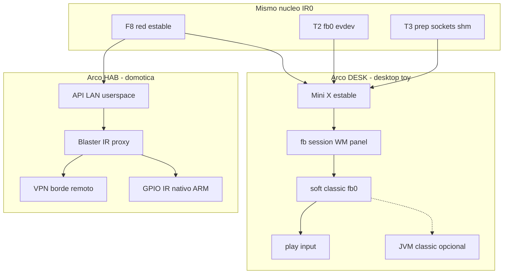
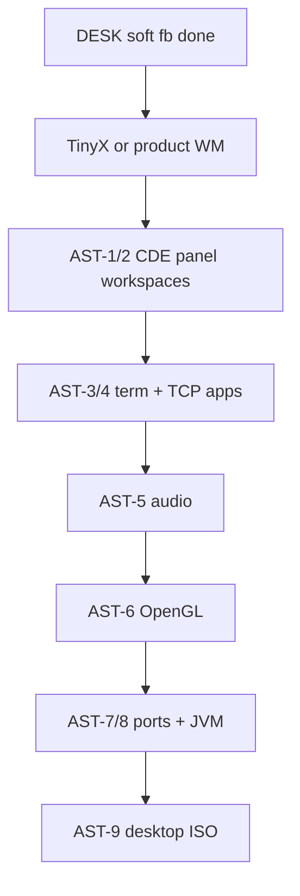

# IR0 Kernel — Consolidated Development Roadmap

> **Last verified:** 2026-07-21 (klog hub + ASSERT_BATCH + runit smoke_tag; HAB/DESK + SEP-1 — see [`BACKLOG_REMAINING.md`](BACKLOG_REMAINING.md), [`ARCH_DEBT_SEP.md`](ARCH_DEBT_SEP.md), [`KTM.md`](KTM.md))  
> **Source of truth:** code under `kernel/`, `mm/`, `sched/`, `fs/`, `net/`, `setup/`, `ktm/`, `scripts/`, and CTR gates in `Makefile`. README and old docs may lag; **grep the tree before claiming “done”.**

This document consolidates tier goals, completed oleadas, reprioritized backlog (storage before TCP/X11), and **recommended evolution milestones**. **What is stable for QEMU test today** is canonical in [`STABLE.md`](STABLE.md). **Open work only:** [`BACKLOG_REMAINING.md`](BACKLOG_REMAINING.md).

---

## Principles (project rules)

| Principle | Meaning |
|-----------|---------|
| **Code over docs** | Agents and maintainers derive status from source + smokes, not README claims. |
| **Facades first** | Portable subsystems talk via `includes/ir0/*`; no `#include <drivers/...>` in `fs/`/`net/`/`mm/`. |
| **One tier at a time** | Vertical slices with runnable proof (ktest, host test, QEMU smoke). |
| **KTM = dev ally** | Kernel Test Module (`ktm/`, `CONFIG_KTM`) is for **developer** regression/debug only — not a userspace security subsystem (that comes later). Must stay low overhead. |
| **Log hygiene** | After a feature is stable, trim debug serial storms (`FASE*`, audit tags) or gate behind Kconfig. |
| **Makefile = tooling** | Historical phase smokes live in `setup/make/legacy-smokes.mk` (`IR0_LEGACY_SMOKE=1`). Default CTR stays lean: `smoke-tier1`, `roadmap-phase*`, `ktm-*`. C test sources are kept; Makefile wiring is curated, not deleted blindly. |
| **Don't break userspace** | Syscall ABI stable unless versioned break documented in `Documentation/mandocs/`. |
| **Post-milestone sprints** | After each green gate / oleada: optimization + architecture sanitization **before** the next big feature. **Rule:** `Documentation/ai_driven_dev/rules/ir0-optimization-arch-sprints.md` (`make ai-dev-rules-install`). |

---

## Maturity ladder (honest)

| Tier | Target | ~Progress | Proof today |
|------|--------|-----------|-------------|
| **T0** | Functional OS + `debug_bins` | ~85% | `make kernel-tests` (29/29), `arch-guard`, pseudo-FS contracts |
| **T1** | POSIX userspace (runit + musl + ash) | ~72–75% | `smoke-tier1`; manifest tier1+múscl; pthread/setuid/perms smokes |
| **T2** | Fullscreen graphics (Doom-class) | ~55% | fb0/evdev/mmap; GUI targets in [`STABLE.md`](STABLE.md) |
| **T3** | Minimal desktop (WM + panel) | ~15–20% | **Planning only** — WM/compositor **out of kernel tree** |

T3 kernel prerequisites (verify with grep before coding): stable T1 boot, T2 fb+input, **POSIX sockets + TCP + AF_UNIX**, USB HID or PS/2 mouse. See `.cursor/rules/ir0-tier-t3-desktop-minimal.mdc`.

---

## Completed milestones (sessions to date)

### T1 / init / shell

| Item | Status | Evidence |
|------|--------|----------|
| Transition path **irinit → runit** (not permanent irinit) | Done | `setup/pid1/`, `load-userspace-runit`, `smoke-runit-boot` |
| **runit** boots and supervises services | Done | `make smoke-tier1` → `smoke-runit-boot` |
| **BusyBox ash** interactive on `/dev/console` | Done | `smoke-runit-ash-interactive` |
| Scheduler policy fix (preempt / RR promotion) | Done | `sched/sched_resched.c`, boot log in `kernel/main.c` |
| Facade includes unified (`<ir0/...>` for kernel/mm/fs/sched/net) | Done | `arch-guard` `ir0-facade-include` |
| **`SCHEDULER_POLICY` in menuconfig** | Documented | `setup/Kconfig` help text |
| **`sys_select` (__NR 23)** | Done | `kernel/syscalls.c`, `includes/ir0/select.h` |
| **Tier1 syscall manifest** | Done | `scripts/ktm_syscall_manifest.py --tier1` — **sin gaps** (incl. `connect`/`accept`) |
| **MUSL cred/signal manifest** | Done | `python3 scripts/ktm_syscall_manifest.py --musl` |
| **memsafe registry test** | Fixed | `tests/kernel_memsafe/test_resource_registry.c` |
| **Phase1 stability gate** | Done | `make roadmap-phase1-stability` (+ `smoke-mm-cow-lazy`) |

### UNIX mínimo + musl (oleada 2026-06, 6 waves)

| Item | Status | Paths / smoke |
|------|--------|----------------|
| ABI musl (`sigaction` 128B, `set_robust_list` 273, cred syscalls) | Done | `process_syscalls.c`, `includes/ir0/signals.h`, `tests/host/test_musl_cred_abi.c` |
| `wait4` status POSIX (`WIFEXITED`/`WIFSIGNALED`) | Done | `includes/ir0/wait.h`, `kernel/process.c` |
| Multi-UID + grupos suplementarios + `fchmod`/*at* | Done | `fs/permissions.c`, `fs/passwd_db.c`, `fs_syscalls.c` |
| `S_ISUID`/`S_ISGID` on exec; deprecate `sudo_auth` | Done | `elf_loader.c`, `CONFIG_IR0_SUDO_AUTH_SYSCALL=n` |
| Señales (`SIGHUP`/`SIGPIPE`, `kill`/`tgkill`, EINTR básico) | Done | `includes/ir0/signals.c`, `io_syscalls.c` |
| Pthreads subset (`CLONE_THREAD`, futex, `exit_group`) | Done | `kernel/futex.c`, `process_clone_thread`, `smoke-musl-pthread` |
| setuid smoke (sin syscall 404) | Done | `setup/pid1/su_setuid_smoke.c`, `make smoke-setuid-exec` |
| Cred contract ktest | Done | `ktest_cred_access_contract`, `make smoke-multiuser-perms` |
| **Hardening oleada (perm + lifecycle + ktest ABI + ATA size)** | Done | [`HARDENING.md`](HARDENING.md), gates 2026-06-23 |

### Networking (POSIX UDP minimum)

| Item | Status | Paths |
|------|--------|-------|
| IPv4 stack (UDP/ICMP/ARP, `/dev/net`) | Done | `net/`, `Documentation/mandocs/en/net.md` |
| **`socket` / `bind` / `sendto` / `recvfrom`** (AF_INET SOCK_DGRAM) | Done | `kernel/sock_udp.c`, `kernel/syscalls/socket_syscalls.c` |
| **`connect` / `accept`** (UDP) | Done | `kernel/syscalls/socket_syscalls.c` — `accept` → `-EOPNOTSUPP` (SOCK_DGRAM) |
| TCP stream ABI | Pending | Stack pieces may exist; no libc-facing TCP syscalls |

### KTM (developer tooling)

| Item | Status | Paths |
|------|--------|-------|
| Unified header | Done | `ktm/include/ktm.h` |
| Invariants / panic classify / ctx snapshot / sched gate | Done | `ktm/ktm_*.c` |
| **`[KTM][PANIC_SITE]` + panic macro audit** | Done | `includes/ir0/oops.h`, `scripts/ktm_panic_inventory.py`, `make ktm-check` |
| Syscall manifest | Done | `scripts/ktm_syscall_manifest.py`, `make ktm-manifest` |
| Host contract tests | Done | `tests/host/test_ktm_sched_contract.c`, `test_ktm_panic_inventory.c` |
| **klog hub + CLASSIFY hygiene** | Done (2026-07-21) | `ktm/klog.c`, `<ir0/ktm/klog.h>`, [`KTM.md`](KTM.md) |
| **ASSERT_BATCH** | Done | `ktm/assert.c`; scenarios `wait_drain` / `reclaim_exit` |
| **`CONFIG_KTM_SERIAL_VERBOSE`** | Done (default n) | `setup/Kconfig`; product serial quieter |
| **Autokill QEMU stderr split** | Done | `scripts/smoke_autokill.py` → `*.qemu-stderr` |
| **runit `ir0_smoke_tag` + hostshare/pause** | Done | `setup/runit/ir0_smoke_tag.h`, `runit_*_payload_run.c` |
| **Not** a user-facing security module | Policy | Future MAC/audit is a separate milestone |

### MM — COW + lazy (~90%)

| Item | Status | Paths |
|------|--------|-------|
| PMM frame refcount | Done | `mm/pmm.c`, `mm/pmm.h` |
| Fork share RO + `#PF` break | Done | `mm/paging.c`, `arch/x86-64/sources/fault.c` |
| FASE40 A/B/C/D | **Pass** | `make smoke-mm-cow-lazy` / legacy `smoke-userspace-fork-mem` |
| **`wait4(pid, NULL, …)` POSIX** | Fixed | `process_wait_wake_blocked_parent` |
| **ELF PT_LOAD VMA metadata** | Done | `process_exec_vma_*`, `process_user_vma_prot()` |
| **Lazy anon `mmap`** | Done (default on) | `CONFIG_LAZY_ANON_MMAP` |
| **Lazy `brk` heap** | Done | `CONFIG_LAZY_BRK_HEAP`, demand-fill in `fault.c` |

### Debug log hygiene (P0)

| Item | Status | Kconfig |
|------|--------|---------|
| `[PF_AUDIT]` gated | Done | `CONFIG_DEBUG_PAGE_FAULTS` |
| `[MMAP_AUDIT]` / `[FASE39]` gated | Done | `CONFIG_DEBUG_MMAP_AUDIT` |
| `[FASE45][FORK_AUDIT]` gated | Done | `CONFIG_DEBUG_FORK` |
| **Dialect → klog** (VFS/NET/IDT/ATA/…) | Done (2026-07-21) | Prefer `klog_*`; no `[COMP][CLASSIFY]` |

### Storage / phase2 (started)

| Item | Status | Evidence |
|------|--------|----------|
| ATA PIO + `block_dev` registration (`hda`–`hdd`) | Done | `drivers/storage/ata_block.c`, `fs/devfs.c` |
| MINIX root from `disk.img` | Done | `CONFIG_ROOT_BLOCK_DEVICE=hda`, boot path |
| VFS mount contracts (proc/tmpfs/multi-fs) | Done | ktests + `runtime-mount-check` |
| **`block_hda_read_contract`** (512-byte read) | Done | `kernel/test/test_debug_contracts.c`; MBR `0x55AA` optional on raw MINIX `disk.img` |
| **`/dev/hda` read at offset 0 (QEMU)** | Fixed | `ata_get_size()` + `dev_disk_read`; ktest 512-byte contract |
| **FAT16 backend** | **On-disk RO + write audit** | `smoke-fat16-mount`; `linux-abi-audit-vfs-write-fat` |
| EXT2 read-only | Done (test) | `smoke-ext2-mount` |
| GPT partition probe | Done (test) | `smoke-gpt-partition` |
| AHCI detect/read/multi + NCQ | Done (test) | `smoke-ahci-read` (`AHCI_NCQ_OK` / `UNSUPPORTED`) |
| NVMe detect+read | Done (test) | `smoke-nvme-read` (`NVME_READ_OK`) |

### Hardening + release 0.0.1 (2026-06-23)

| Item | Status | Evidence |
|------|--------|----------|
| **H1–H6** | Done | [`HARDENING.md`](HARDENING.md) |
| **0.0.1 baseline** | Closed (maintainer) | [`STABLE.md`](STABLE.md) — runit, tcc, BusyBox+, COW, lazy |

### Architecture / build (2026-06-23)

| Item | Status |
|------|--------|
| Legacy smokes extracted | `setup/make/legacy-smokes.mk` |
| Rust driver template | `rust_simple_driver.rs` |
| **`kernel/syscalls.c` split (ARCH-1 / H1)** | **Done** — 86 L glue |
| **FASE43–48 → `kernel/debug/fase_audit.c` (H2)** | **Done** |
| **Facade hygiene (H3)** | **Done** — arch-guard rule 14 |
| **`make kernel-text-budget` + `health` (H6)** | **Done** — ~815754 B / 850000 cap |
| `roadmap-phase2-driver-expansion` | `runtime-net-check` + `runtime-mount-check` |
| `roadmap-phase3-core-features` | Placeholder gate after phase2 |

---

## Release 0.0.1 — stable baseline

**Canonical checklist:** [`STABLE.md`](STABLE.md) (QEMU serial + GTK, smokes, explicit non-goals).

Closed for 0.0.1 (re-validate with `make release-0.0.1` or `make smoke-release-0.0.1`):

- Hardening H1–H6
- runit, musl userspace ISO, BusyBox ash (+ `CONFIG_WHOAMI` in minimal config)
- TinyCC + Doom+**IWAD** + posix — merge blockers in [`STABLE.md`](STABLE.md)
- COW fork + lazy anon mmap/brk (`smoke-mm-cow-lazy`)
- AF_UNIX + TCP loopback (`smoke-stream-sock`); host-share virtio-**9p** (`smoke-hostshare-9p`)
- T2: fb0/input + `smoke-fase55d-doomgeneric` (real WAD); stub 55b = fast aid only

**0.0.2 (next):** F8 TCP beyond loopback / NIC. **Out of 0.0.1:** CFS/SMP, X11/WM, virtiofs+FUSE.
See version matrix in [`STABLE.md`](STABLE.md). Open Future: [`BACKLOG_REMAINING.md`](BACKLOG_REMAINING.md).

---

## Post-0.0.1 backlog (not “listo”)

### COW / lazy (enhancements only)

**0.0.1 closed:** hybrid COW + lazy mmap/brk — `smoke-mm-cow-lazy`.  
**Remaining:** 2 MiB huge-page COW; optional stack COW.

### FAT / block storage

- **0.0.1:** MINIX root, `/dev/hda` read, FAT16 read-only MVP on block (`fs/fat16_disk.c`).
- **`fat0` virtual mount** still uses simplefs engine (by design).
- **Next:** FAT write path, EXT2 read-only, AHCI.

### POSIX depth (T1+)

- `pthread_create` via musl libc in smoke (POSIX-1; today clone path in smoke)
- Robust mutex teardown; `SA_RESTART`; PTY + job control

### Architecture scale

SMP, CFS backend, kernel modules (MOD-*) — see P2 below.

---

## Backlog — reprioritized (2026-06-15)

**User decision:** storage / drivers / arch **before** full TCP stack and X11.

### P0 — closed (MM + T1 boot confidence)

1. ~~FASE40_D / COW hybrid~~ — Done.
2. ~~Lazy anon mmap + lazy brk~~ — Done.
3. ~~Debug log gating (PF/MMAP/FORK)~~ — Done.
4. ~~`smoke-tier1` green~~ — Done.
5. ~~UDP `socket`/`bind`/`sendto`/`recvfrom`~~ — Done.

### P1-storage — phase2 driver expansion (**closed** — `make smoke-p1-storage`)

| # | Item | Notes |
|---|------|-------|
| 6 | **`roadmap-phase2-driver-expansion` green** | `runtime-net-check` + `runtime-mount-check` |
| 7 | **Real FAT16 on `block_dev`** | **Done** — RO + write audit |
| 8 | **FAT16 QEMU smoke** | **Done** — `smoke-fat16-mount` |
| 9 | **EXT2 read-only** | **Done** — `smoke-ext2-mount` |
| 10 | **AHCI/SATA** | **Done** — `smoke-ahci-read` (+ NCQ F2) |
| 11 | **Host contract tests for `block_dev`** | **Done** — `tests/host/test_blockdev_facade.c` |
| 12 | **GPT partition table** | **Done** — `smoke-gpt-partition` |
| 12b | **`/dev/hda` userspace read** | **Done** |
| 12c | **NVMe detect+read** | **Done** — `smoke-nvme-read` (F6) |

### P1-T1 — POSIX hardening (**partial close** 2026-07-11)

| # | Item | Notes |
|---|------|-------|
| 13 | **`epoll` / `pselect6`** | **Done** — `smoke-epoll-basic` (pselect6 wired) |
| 14 | **`prlimit` / `getrlimit`** | **Done** — `smoke-prlimit` |
| 15 | **Futex robustness** | **MVP** — `get_robust_list` + exit wake (`smoke-robust-list`) |
| 16 | **Syscall split** | **Done (H1)** |
| 17 | **PTY + `TIOCGWINSZ` / `SIGWINCH`** | **Done** — `TIOCSWINSZ` + `PTY_WINCH_SENT` (`smoke-pty-winsz`) |

### P2 — arch scale + driver infra

| # | Item | Notes |
|---|------|-------|
| 18 | **Rust/C++ driver platform (definitive ABI)** | Stable `probe`/`remove` via `includes/ir0/*`; mandocs + `DECOUPLING.md` — **DRV-*** |
| 18b | **Fast incremental Rust/C++ build** | `unibuild-rust`, `test-driver-cpp`, ccache — **BUILD-1** |
| 18c | **Reference driver vertical slice** | Rust or C++ → registry → `/dev`/sysfs → smoke — **DRV-4** |
| 18d | **Kernel module loader + modprobe** | ELF reloc, `insmod`/`rmmod`/`modprobe` — **MOD-*** |
| 19 | **Scheduler backend (CFS/priority)** | **Partial** — priority bands = real ops backend (`sched.h`); CFS policy `1` = honest RR alias (no fake `cfs_sched` wrapper). Real CFS runqueue still open. |
| 20 | **SMP** | Per-CPU runqueue, IPI, pmap shootdown — major oleada |
| 21 | **ACPI/PCI enumeration hardening** | NIC + storage discovery on real HW |

### P2-T1 — BusyBox / ash completeness (user priority)

| # | Item | Notes |
|---|------|-------|
| 17b | **Full ash + required applets in rootfs** | **BUSY-1 DONE** — `setup/busybox/required_applets.txt` + inject on runit disk |
| 17c | **Applet smoke** | **BUSY-2 DONE** — `make smoke-busybox-manifest` → `BUSYBOX_MANIFEST_OK` |

Tag `v0.0.1-rc2` closed automated product gates except maintainer **manual VM** for final ship.

### P3 — network + desktop (after P1-storage stable)

| # | Item | Notes |
|---|------|-------|
| 22 | **TCP stream `send`/`recv`/`listen`** | **Partial DONE** — loopback + guest wire via `smoke-stream-sock` / `smoke-tcp-*` |
| 23 | **AF_UNIX stream + `socketpair` + abstract + `SCM_RIGHTS`** | **DONE** — `smoke-socketpair`, `smoke-unix-abstract`, `smoke-scm-rights` |
| 24 | **X11 vs fbdev vs Wayland** | Plan mode; userspace aparte — **kernel prep checklist DONE** (fb MAP_SHARED, AF_UNIX, SCM_RIGHTS, SysV shm, memfd MAP_SHARED, sock poll) |
| 25 | **WM + panel** | Not in kernel tree |

---

## Sprints de optimización y arquitectura (post-hito)

**Project rule (mandatory):** `Documentation/ai_driven_dev/rules/ir0-optimization-arch-sprints.md`
— install locally with `make ai-dev-rules-install`. After each milestone with green CTR gates,
run **≥1 sprint** before starting the next large feature.

Estos sprints **no bloquean** el avance por tier indefinidamente, pero **sí** son obligatorios
tras gates verdes del hito anterior. Cada sprint cierra con `make arch-guard` + CTR mínimo.

| Sprint | Gate de entrada (hito previo) | Objetivo | Entregable / verificación |
|--------|------------------------------|----------|---------------------------|
| **ARCH-1** syscall split | T1 manifest verde + `smoke-tier1` | Reducir `syscalls.c`; una responsabilidad por archivo | **Done** — 86 L glue |
| **ARCH-2** facade audit | ARCH-1 o cambio ≥2 subsistemas | Cero acoplamiento `fs/`→`drivers/`; includes `<ir0/*>` | `python3 scripts/architecture_guard.py` sin violaciones |
| **ARCH-3** resource lifecycle | Cualquier oleada MM/process/IPC | Par `acquire`/`release` en todos los paths de error | ktests repetidos + review `process_exit` ordering |
| **ARCH-4** log hygiene | Feature estable en QEMU | Quitar serial storms; Kconfig `DEBUG_*` | Boot log acotado en `smoke-tier1` |
| **ARCH-5** host contracts | Nuevo syscall o facade pública | Test host sin colisión glibc (`tests/host/`) | `make -C tests/host run` verde |
| **PERF-1** hot paths | T1 boot estable | Poll/sleep sin spin; wake batching | `ktm_poll_arch_resume_matrix`, idle profile |
| **PERF-2** MM / COW | `smoke-mm-cow-lazy` verde | huge-page COW; menos TLB shootdown | FASE40 extendido |
| **PERF-3** driver build | Rust/C++ driver edit loop | Incremental compile; ccache | `unibuild-rust`, `test-drivers` |
| **POSIX-1** threads musl | `smoke-musl-pthread` verde | `pthread_create`+`join` libc; robust mutex exit | Nuevo smoke; sin `clone` inline |
| **POSIX-2** job control | PTY milestone | `SA_RESTART`, sessions, `SIGHUP` en controlling TTY | ktests señales + ash job smoke |

**Orden recomendado tras oleada UNIX:** ARCH-2 → POSIX-1 → ARCH-1 (resto) → PERF-1 → P1-storage (paralelo).

**Anti-patrones de sprint:** refactor masivo sin smoke; crecer `syscalls.c`; marcar tier done sin manifest + QEMU.

---

## Future priority milestones (maintainer vision)

Planned **after** stable T1 + post-milestone sprints. Suggested order: **ash completeness →
driver platform (static ABI, then modules) → P1-storage → TCP/T2 → T3 prep**.

### T1 — BusyBox ash + applets

| ID | Milestone | Why | Paths / proof |
|----|-----------|-----|---------------|
| **BUSY-1** | ash + essential applets in production rootfs | **Done** — `required_applets.txt` + `busybox_inject_manifest.sh` | `setup/busybox/`, `setup/runit/install-to-disk.sh` |
| **BUSY-2** | Required-applet manifest smoke | **Done** — `smoke-busybox-manifest` | `setup/pid1/fase58l_busybox_smoke.c` |
| **BUSY-3** | Broader applet parity with minimal Linux embed | Operational parity for tier1 POSIX | BusyBox Kconfig + rootfs size budget |

Today: `smoke-busybox-manifest` proves product applets on disk (`BUSYBOX_MANIFEST_OK`); `smoke-tier1` covers interactive ash.

### Kernel modules — dynamic loader and modprobe

| ID | Milestone | Why | Paths / proof |
|----|-----------|-----|---------------|
| **MOD-1** | Kernel module format (ELF reloc, symbols, init/exit) | Optional HW without monolithic relink | New subsystem; proposed facade `includes/ir0/module.h` |
| **MOD-2** | `insmod` / `rmmod` / `modprobe` userspace | Runtime load like Linux; `modules.alias` | BusyBox or minimal util + `/etc/modules` |
| **MOD-3** | Same `probe`/`remove` as static drivers | Registry integration | `drivers/`, `arch-guard` — no `fs/`→`drivers/` includes |

Today: `rust_simple_driver` and C++ test objects link **statically** (`Makefile` `RUST_DRIVER_OBJS`).

### Driver platform — Rust / C++ (definitive dev interface)

| ID | Milestone | Why | Paths / proof |
|----|-----------|-----|---------------|
| **DRV-1** | Stable driver registration ABI | One C contract for Rust, C++, and C | `includes/ir0/`, `Documentation/DECOUPLING.md` |
| **DRV-2** | Templates + mandocs (“how to write a driver”) | Consistent human/AI review | `rust/drivers/`, C++ driver tree, mandocs |
| **DRV-3** | `arch-guard` rules for driver boundaries | Portable vs arch separation | `scripts/architecture_guard.py` |
| **BUILD-1** | Fast incremental Rust/C++ compile | Driver iteration without full `kernel-x64.bin` | `unibuild-rust`, `test-driver-cpp`, ccache |
| **DRV-4** | **Vertical slice:** one integrated reference driver | build → load (static or MOD-*) → `/dev`/sysfs → smoke | `make test-drivers`, dedicated smoke |

Current references: `rust/drivers/rust_simple_driver.rs`, `make test-driver-rust`, `make test-driver-cpp`.

### Cross-cutting (storage, net, graphics — existing backlog)

| Area | Milestones | Notes |
|------|------------|-------|
| **P1-storage** | FAT16/EXT2/AHCI **done for test**; **NVMe** = F6 | Before heavy Internet NIC (roadmap decision) |
| **P1-net** | TCP stream, `AF_UNIX` | After storage phase2 stable |
| **P1-term** | PTY, `TIOCGWINSZ`, `SIGWINCH` | Full ash + terminal clients |
| **T2** | MAP_SHARED fb0 (**DONE** `smoke-fb-map-shared`), multitouch input, frame timing | `smoke-fase55b-doom-stub` regression open |
| **T3 prep** | Sockets + TCP + AF_UNIX + `socketpair` + USB HID | `ir0-tier-t3-desktop-minimal` |

### Future product arcs (same kernel, two demos)

Canonical IDs and proof gates: [`BACKLOG_REMAINING.md`](BACKLOG_REMAINING.md) (**HAB-***, **DESK-***, **AST-***; Future rows **F14** / **F15** / **F16**).

**Defaults (locked):**

| Topic | Choice |
|-------|--------|
| Remote access outside home | WireGuard / Tailscale (or equivalent VPN) into LAN; API stays on subnet — **no** naked port-forward to IR0 |
| AC IR actuation | ESP (or similar) HTTP blaster first; native GPIO IR only after F7b GPIO (**HAB-4**) |
| First classic-style game | **soft_fb0** gate **DESK-3 DONE** (`CLASSICUBE_OK`); upstream ClassiCube+GL lab-blocked; Mojang jar / JVM = **DESK-5** BLOCKED |
| Kernel role | Networking (F8) + later GPIO; **no** in-kernel AC protocol or WM |



**Work order (same as oleadas):** After DESK soft path, **SEP-1** locked tree boundaries ([`IR0-desktop/Documentation/TREE_CONTRACT.md`](../../IR0-desktop/Documentation/TREE_CONTRACT.md)). Next: ARCH debt ([`ARCH_DEBT_SEP.md`](ARCH_DEBT_SEP.md)) before real TinyX/WM. HAB still open. Soft DESK smokes are **optional** (not `release-0.0.1`).

**Not claimed done:** Desktop product ISO, AC control, IR TX, upstream ClassiCube+GL, TinyX X-WM, Minecraft/JVM, Astral-class demo (AST-*).

### North star — Astral-class desktop (aspirational, post-DESK)

Maintainer long-term product vision (2026-07-18): a **usable CDE-like hobby desktop** on IR0, in the spirit of demos such as [Astral](https://astral-os.org/about.html) ([Mathewnd/Astral](https://github.com/Mathewnd/Astral): custom C kernel, x86-64, X.org, audio, GL, ports) — **not** a clone of Astral, and **not** in scope for release 0.0.1.

Canonical IDs: [`BACKLOG_REMAINING.md`](BACKLOG_REMAINING.md) (**F16** / **AST-***). All rows below are **Future** until a smoke or ship ISO proves them. Kernel stays platform; WM/apps live in `IR0-desktop` / userspace.

| Capability (reference desktop photo) | Future ID | Depends (honest) | Status |
|--------------------------------------|-----------|------------------|--------|
| Bottom panel + clock + launcher icons | **AST-1** | Product WM (post TinyX/DESK-2) | Soft panel smoke only (`smoke-desk-wm`); not CDE product |
| Virtual workspaces (One / Two / Three / Four) | **AST-2** | AST-1 + session manager | Not started |
| Terminal client on desktop | **AST-3** | PTY + X/fb terminal | Partial (ash/console); no desktop terminal product gate |
| Network chat client (`irssi` / IRC over TCP) | **AST-4** | F8 Internet TCP + DNS + PTY | Stack MVP; no `irssi` ship proof |
| Audio / music player (MOC-class) | **AST-5** | Sound driver + mixer ABI + `/dev/snd` or equiv. | Not started |
| 3D / OpenGL demo (`glxgears`) | **AST-6** | Mesa/GL or soft GL + DRM/KMS (or X GLX) | **BLOCKED** — no Mesa/GL on IR0 |
| Ported GUI editors (Notepad++-class) | **AST-7** | Stable X session + libc/porting depth | Aspirational |
| Classic Minecraft / JVM client | **AST-8** (= **DESK-5**) | JVM or compatible runtime on musl | **BLOCKED** — no done without binary |
| Shipable desktop ISO (panel + apps concurrent) | **AST-9** | AST-1…4 + SEP desktop rootfs | Not started |

**Order after DESK soft path:** TinyX/product WM → AST-1/2 (CDE shell) → AST-3/4 (terminal + TCP apps) → AST-5 (audio) → AST-6 (GL) → AST-7/8 (ports) → AST-9 (ISO). Do **not** pull AST-* into 0.0.1 or Hab/DESK soft smokes.



---

## Evolution milestones (easy to forget)

### Durability and I/O

| Milestone | Why it matters |
|-----------|----------------|
| **Page cache (file-backed)** | Performance + correct `mmap` MAP_SHARED semantics |
| **`fsync` / `fdatasync` / `sync`** | Databases, package managers, init scripts |
| **Writeback queue** | Ties page cache to block layer |
| **Initramfs / cpio early root** | Boot without MINIX-only inject; disaster recovery |

### Boot and deploy

| Milestone | Why it matters |
|-----------|----------------|
| **Stable boot from external `disk.img`** | No ad-hoc sector inject for every smoke |
| **EFI stub polish** | Real hardware beyond legacy BIOS QEMU |
| **Rootfs reproducible build** | `make disk.img FS=fat16` + documented layout |

### POSIX / libc depth (T1+)

| Milestone | Why it matters |
|-----------|----------------|
| **PTY (`/dev/ptmx`, `openpty`)** | ssh-like sessions, ncurses resize |
| **`SIGWINCH` + `TIOCGWINSZ`** | Terminal-aware apps |
| **`shm_open` / SysV shm / MAP_SHARED anon** | SysV + `memfd_create` + `/dev/shm` DONE |
| **`timerfd` / `signalfd`** | `timerfd` DONE (`smoke-event-fds`); `signalfd` still open |
| **`inotify` (minimal)** | runit/service watchers |

### Reliability and ops

| Milestone | Why it matters |
|-----------|----------------|
| **OOM killer path** | Prevent silent hang under memory pressure |
| **Watchdog (soft)** | QEMU/real HW hang detection in smokes |
| **`/proc/self/maps` contract tests** | Exec, mmap, COW regression guard |

### T2 graphics prep

| Milestone | Why it matters |
|-----------|----------------|
| **`mmap` MAP_SHARED fb0** | **DONE** — `smoke-fb-map-shared` (`FB_MAP_SHARED_OK`) |
| **Input `EV_ABS` / multitouch** | Beyond PS/2 buttons |
| **Frame timing / vsync hook** | Doom-class pacing |
| **`SCM_RIGHTS` / abstract `@` unix** | **DONE** — `smoke-scm-rights`, `smoke-unix-abstract` |
| **SysV / `shm_open` MAP_SHARED anon** | **DONE** — `smoke-sysv-shm`, `smoke-memfd-shared`, `smoke-posix-shm` |
| **`timerfd` / `eventfd`** | **DONE** — `smoke-event-fds` |
| **sock poll/epoll on streams** | **DONE** — covered by `smoke-unix-abstract` (`SOCK_POLL_OK`) |

### Security (post-T1, separate from KTM)

| Milestone | Why it matters |
|-----------|----------------|
| **Userspace capability / MAC** | Not KTM — real policy module |
| **W^X enforcement audit** | NX + VMA prot on all user mappings |

---

## User-request index (conversation backlog)

| Request | Roadmap section |
|---------|-----------------|
| Develop from **code**, not stale README | Principles |
| **runit** after irinit | T1 completed |
| **ash** working | T1 completed |
| **COW + lazy alloc** | MM completed (~90%) |
| **Storage before TCP/X11** | P1-storage backlog |
| **FAT, EXT2, SATA, NVMe** | P1-storage |
| **Rust/C++ drivers, SMP, sched plugable** | P2 |
| **UDP sockets** | Done (TCP deferred) |
| **Add evolution milestones** | Evolution milestones section |
| **KTM** dev tooling | Completed / policy |
| **`sys_select`** | Done |
| **Post-hito optimization sprints as project rule** | `ir0-optimization-arch-sprints.md` + Sprints section |
| **Full BusyBox ash + applets** | P2-T1 / BUSY-* milestones |
| **Dynamic loader + modprobe** | P2 / MOD-* milestones |
| **Rust/C++ driver ABI + fast build + reference driver** | P2 / DRV-* + BUILD-1 |
| **Everything else in roadmap** | P1-storage, P1-T1, P3, Evolution milestones |
| **Astral-class desktop north star** (panel, workspaces, audio, GL, irssi, JVM) | Future product arcs → **AST-*** / **F16** |

---

## Validation gates (CTR)

### Every merge (minimum)

```bash
make -s kernel-x64.bin
python3 scripts/architecture_guard.py   # or: make arch-guard
make -s build-matrix-min
make -s -C tests/host run
```

### Merge → `master` — product blockers (maintainer)

Per [`STABLE.md`](STABLE.md): **TinyCC** + **Doom+IWAD (55d)** must PASS. Do not merge on CTR/release alone.

```bash
make smoke-tcc-power-halt
make IR0_LEGACY_SMOKE=1 smoke-fase55d-doomgeneric
# stub 55b = fast aid only; plus smoke-fase55c-timing-input when touching fb/input
```

### Tier-1 active smokes

```bash
make smoke-tier1          # runit-boot + ash-interactive
make smoke-mm-cow-lazy    # FASE40 COW/lazy gate
make smoke-multiuser-perms  # cred owner/group/other (ktest tag)
make smoke-musl-pthread   # CLONE_THREAD + futex path
make smoke-setuid-exec    # S_ISUID on exec (no sudo_auth 404)
```

### Phase gates

```bash
make roadmap-phase1-stability
make roadmap-phase2-driver-expansion   # phase1 + runtime-net + runtime-mount
make roadmap-phase3-core-features    # after phase2
```

### Storage / mount

```bash
make kernel-tests           # 29 ktests incl. block_hda_read_contract
make runtime-mount-check
```

### KTM

```bash
make ktm-manifest         # tier1 syscall wiring
make ktm-manifest -- --tier1   # expect no missing entries
make ktm-manifest -- --musl    # musl cred/signal set
```

---

## Oleada merge order (multi-agent)

```
Kconfig/defconfig/Makefile
  → includes/ir0/* facades
  → kernel/fs/mm (portable)
  → arch/* + asm
  → drivers/*
  → tests (host, ktest, memsafe)
  → docs (only when user approves)
```

---

## Anti-patterns

- Marking COW or lazy alloc “done” without `smoke-mm-cow-lazy` / FASE40 D green.
- Claiming **FAT16** done because `mount -t fat16` works on **virtual** `fat0`.
- Implementing WM/compositor inside `kernel/`.
- Growing `kernel/syscalls.c` without split plan (`ARCH_DEBT` comment).
- Claiming “TCP complete” without stream socket syscalls.
- KTM probes in hot paths without `CONFIG_KTM` / `IR0_KERNEL_TESTS`.

---

## Related docs

| Doc | Topic |
|-----|--------|
| [`STABLE.md`](STABLE.md) | Release 0.0.1 stable baseline + QEMU UI matrix |
| `SETUP.md` | QEMU, disk, init inject |
| `Documentation/MEMORY.md` | PMM, paging, COW/lazy |
| `Documentation/PROCESSES.md` | fork, wait, exit |
| `Documentation/mandocs/en/net.md` | Net stack + UDP sockets |
| `Documentation/mandocs/en/vfs.md` | Mount, backends |
| `Documentation/ai_driven_dev/rules/ir0-roadmap-research-multiagent.md` | Agent rule summary |
| `Documentation/ai_driven_dev/rules/ir0-optimization-arch-sprints.md` | Post-milestone optimization + architecture sprints |
| `Documentation/esp/BACKLOG_REMAINING.md` | Spanish backlog mirror (HAB/DESK summary) |
| `Documentation/BACKLOG_REMAINING.md` | Open work + HAB/DESK ID tables |
